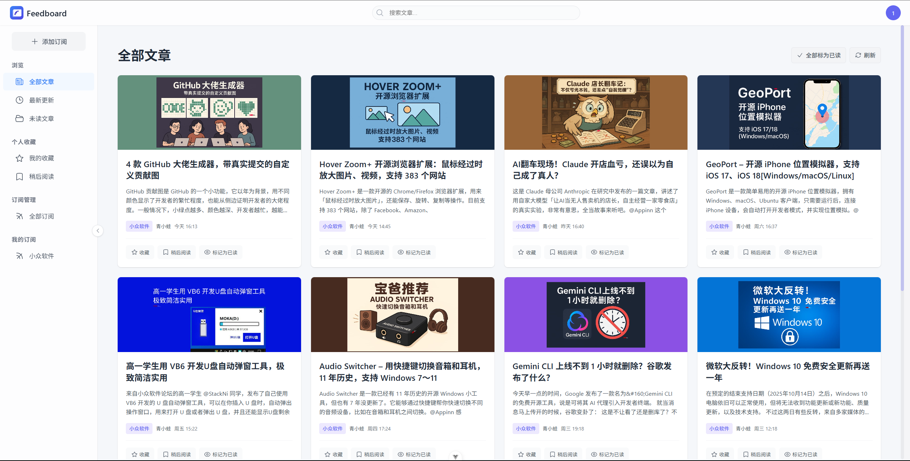
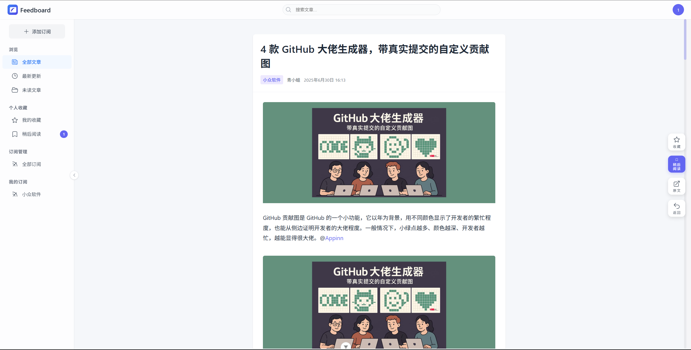
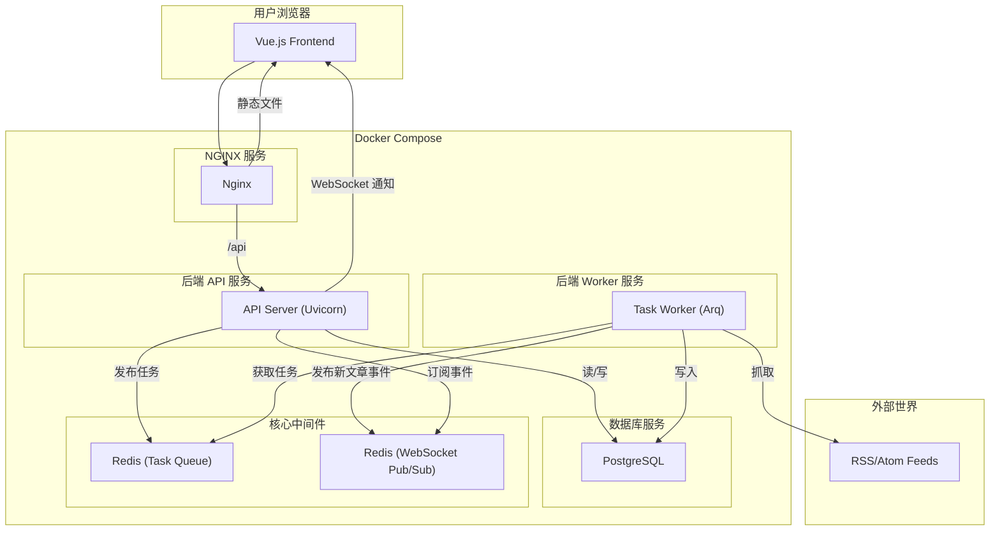

  
  <h1>Feedboard</h1>
  

    
    
    
    
    
    
    
  

  
<strong>一款现代、高效、简洁的 RSS 订阅平台</strong>

  

  

---

## ✨ 功能亮点

- 🚀 **极致性能**: 后端采用 FastAPI 异步框架，前端基于 Vite + Vue 3，带来极致的响应速度和开发效率。
- 🎨 **精美 UI**: 界面清晰、操作直观，提供沉浸式阅读体验。
- 🔄 **实时更新**: 通过 WebSocket 实现新文章的实时推送和未读数更新，信息获取快人一步。
- 🐳 **完全容器化**: 使用 Docker 和 Docker Compose 实现一键部署，无论是开发还是生产环境都轻松搞定。
- ⚡ **闪电般构建**: 后端构建集成 `uv`，享受比 `pip` 快 10-100 倍的依赖安装速度。
- 🔍 **强大搜索**: 支持在所有订阅文章中进行全文关键词搜索。
- ⚙️ **高度可定制**: 提供丰富的偏好设置，包括字体大小、通知开关、刷新频率等。
- 📂 **轻松迁移**: 支持通过 OPML 文件导入和导出订阅列表，方便在不同工具间无缝切换。
- 🔐 **安全可靠**: 基于 JWT 的安全认证体系，采用 HTTPOnly Cookie，有效保护用户数据和凭证安全。

## 📸 应用截图

<table>
  <tr>
    <td align="center"><strong>主界面</strong></td>
    <td align="center"><strong>文章阅读</strong></td>
  </tr>
  <tr>
    <td></td>
    <td></td>
  </tr>
</table>

## 🏛️ 系统架构

Feedboard 采用前后端分离、服务化的现代架构，确保了系统的高内聚、低耦合，易于维护和扩展。

## 🛠️ 技术栈

| 类别          | 技术/库                                          | 描述                                           |
| ------------- | ------------------------------------------------ | ---------------------------------------------- |
| **后端**      | FastAPI, Tortoise-ORM, Arq, uv, Loguru, Pydantic | 高性能异步API、异步ORM、任务队列、包管理、日志 |
| **前端**      | Vue 3, Vite, TypeScript, Pinia, TailwindCSS      | 现代化的前端开发全家桶                         |
| **数据库**    | PostgreSQL, sqlite                               | 成熟、可靠的关系型数据库                       |
| **缓存/队列** | Redis                                            | 用于后台任务队列和WebSocket消息发布/订阅       |
| **部署**      | Docker, Docker Compose, Nginx                    | 全容器化部署，Nginx作为前端静态服务和反向代理  |

## 📄 许可证

本项目采用 MIT 许可证。详情请参阅 [LICENSE](LICENSE) 文件。
